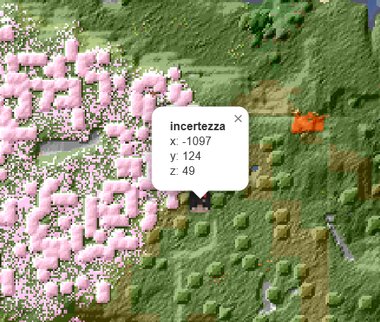
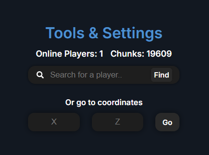
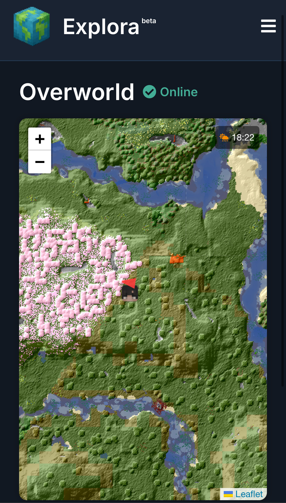

# Explora 🌎

Explora is a real-time Minecraft world viewer that visualizes all explored chunks using a Spigot plugin, a Node.js backend, and a React frontend. Designed for performance and real-time updates 

## 🚀 Features
- 🧭 Real-time chunk tracking via a lightweight Spigot plugin
- 🌐 WebSocket backend for live data transmission
- 🗺 Interactive map with:
  - Hover-based **block coordinates and live world time**
  - Live **player overlays** with smooth updates
  - Player finder and location jump tools
  - Mobile-optimized UI for on-the-go viewing
  - ⚡️ Optimized rendering and data caching

## 📸 Preview

### 🗺️ Live Map Viewer
Visualizes explored chunks in real time with smooth zoom and pan.
Displays Minecraft coordinates and in-game time as you hover the map.

---

### 👤 Live Player Overlay + Finder Tools
Track active players, click to focus, or jump to known locations.

#### 🔴 Live Player Tracking

#### ℹ️ Player Information

#### 🛠 Location Tools UI

### 📱 Mobile Support

Fully responsive interface — access your world map from any device.
 

## 📦 Project Structure

- `plugin/` – Spigot plugin (Java) for tracking explored chunks
- `backend/` – Node.js server for WebSocket communication and data storage
- `frontend/` – React-based chunk viewer with Leaflet map
- `assets/` - Screenshots and demo gifs

## 🚧 Status

Explora is currently in **beta development**. The core systems — plugin, backend, and frontend — are fully functional and integrated:

- ✅ **Spigot plugin** successfully tracks explored chunks in real time and integrates cleanly with Minecraft.
- ✅ **Backend server** (Node.js) enables real-time updates via WebSocket, serving client map data and player overlays.
- ✅ **Frontend viewer** (React + Leaflet) renders the map, player positions, and tooltip overlays responsively on both desktop and mobile.
- ✅ **Live overlay tools** include block coordinate inspector, server time display, player tracking, and search utilities.
- 🔄 Ongoing performance tuning and minor UX improvements.

## ✨ Goals

- [x] Track explored chunks in real-time
- [x] Display a visual chunk map
- [x] Deploy and test full stack (plugin → backend → frontend) on a Raspberry Pi 5
- [x] Add coordinate/time info when hovering over the map
- [x] Build a responsive layout for both desktop and mobile devices.
- [ ] Add UI polish and cleanup; performance improvements for the spigot plugin

## 📝 License

This project is licensed under the [MIT License](LICENSE).

## 🙌 Contributing

Found a bug? Have an idea?  
Feel free to [open an issue](https://github.com/jvallejoromero/explora/issues) or submit a pull request.